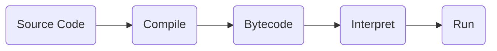

#### 1. Program and Compiler



#### 2. Variable and Type

|                    Typed                    |                     Typing                     |
| :-----------------------------------------: | :--------------------------------------------: |
| Dynamic(same variable hold different types) |   Weak (allow typecasting if it makes sense)   |
|          **Static** (specify type)          | **Strong** (only allow typecasting to subtype) |

`byte` (8) $<$ `short`(16) $<$ `int`(32) $<$ `long`(64) $<$ `float` $<$ `double`

`char`(16) $<$ `int`(32)

#### 7. Class Fields

```java
class Object {
    static classVariable = value;
}
```

#### 9-11. Composition, Inheritance and Overriding

Composition: `has-a` relationship

Inheritance: `is-a` relationship

```java
class SubClass extends SuperClass {
    // subclass variables
    Type variable = value;
    // constructor
    Object(Type arg) {
        super(Type arg);
	}
    @Override
    void do() {...}
}
```

#### 12. Polymorphism

```java
public boolean equals(Object obj) {
    if (obj instanceof A_Class) {
        A_Class inst = (A_Class) obj;
        return (inst.var.equals(this.var));
    }
    return false;
}
```

#### 13. Liskov Substitution Principle

If $S <: T$ , then an object of $T$ can be replaced by that of $S$ without changing the desirable property of the program

To prevent inheritance, use keyword `final`

#### 14. Abstract Class

```java
abstract class Shape {
  // must be overridden
  public abstract double getArea();
}
```

#### 15. Interface

For classes that does not follow `is-a` relationship

```java
interface GetAreable {
	public abstract double getArea();
}
```

`default`: impure interface

#### 16. Wrapper Class

Immutable, slower performance than primitive types

```java
Integer i = new Integer(10);
int j = i.intValue();

Integer i = 5;	// auto-boxing
int j = i;			// auto-unboxing
```

#### 17. Casting

Since `Circle` $< :$ `GetAreable`, narrowing type conversion will cause compile-time error

```java
// ok, not useful, cannot use as circle
GetAreable ga = findLargest(circles);
Circle c1 = findLargest(circles);						// error
Circle c2 = (Circle) findLargest(circles);	// ok
```

#### 18. Variance

Let $C(T)$ be a complex type based on type $T$, complex type is:

- ==covariant== if $S <: T \to C(S) <: C(T)$ **(Java arrays)**
- contravariant if $T <: S \to C(S) <: C(T)$
- ==invariant== if neither **(generics)**

```java
// no compile-time error, has run-time error
Integer[] intArray = new Integer[3] {1, 2, 3};
Object[] objArray = intArray;
objArray[0] = "String";
```

#### 19. Exception

```java
try {
  method();
} catch (Exception1 e) {
  // handle exception
} catch (Exception2 | Exception3 e) {
  // handle multiple exception similarly
} finally {
  // clean up, regardless of exception
}

public void method() throws SomeException {
  if (...) {
    throw new SomeException("exception message");
  }
}
```

Unchecked exception:

- Programmer's errors, subclasses of `RuntimeException`

Checked exception:

- Programmer has no control over, must be handled

```java
class Test {
  static FileReader openFile(String filename) {
    try {
      return new FileReader(filename);
    } catch (FileNotFoundException e) {
      System.err.println("unable to open");
    }
  }
  public static void main(String[] args) {
    openFile();
  }
}

// pass exception to caller
class Test {
  static FileReader openFile(String filename)
    		throws FileNotFoundException {
    return new FileReader(filename);
  }
  public static void main(String[] args) {
    try {
			openFile();
    } catch (FileNotFoundException e) {
      System.err.println("unable to open");
    }
  }
}
```

Bad practices:

- pass everything to caller
- catch-them-all (`catch (Exception e)`)
- overreact by exiting
- break abstraction barrier
- use exception to handle logic flow

#### 20. Generics

Generics are **invariant**, as it would violate LSP

##### Types:

```java
class Pair<S,T> {
  private S first;
  private T second;
 
  public Pair(S first, T second) {
    this.first = first;
    this.second = second;
  }
  
  S getFirst() {...}
  T getSecond() {...}
}

class Dict<T> extends Pair<String,T> {...}
```

Prevents run-time `ClassCastException` if we use `Object`

##### Methods:

```java
public static <T> boolean contains(T[] array, T obj) {
  for (T curr : array) {
    if (curr.equals(obj)) { return true; }
  }
  return false;
}

// <String>contains.(strArray, subStr)
```

Nonsensical to use `Object` if `array` and `obj` are of different type

##### Bounded Type Parameters:

class: `implements Interface` 	sub-type: `extends Interface`

```java
public static <T extends GetAreable> T findLargest(
  	T[] array) {
  ...
  for (T curr : array) {
    double area = curr.getArea();
    ...
  }
  ...
}
```

`T` $<:$ `GetAreable` and has `getArea()` method

```java
class Pair<S extends Comparable<S>,T>
  		implements Comparable<Pair<S,T>> {
  private S first;
  private T second;
  ...
  public int compareTo(Pair<S,T> pair) {
    return this.first.compareTo(pair.first);
  }
}
```

#### 21. Type Erasure

Code specialisation: create a new type for every generic instantiation

Code sharing: erase type parameters and type arguments after type checking, replace with `Object`, ==bounded type parameter replaced by bounds==

##### Heap pollution (implication of type erasure):

```java
// NOT valid syntanx!
Pair<String,Integer>[] pairArr = new Pair<>[1];
Object[] objArr = pairArr;
// no ArrayStoreException
objArr[0] = new Pair<Double,Boolean>(3.14, true);
// run-time ClassCastException
String str = pairArr[0].getFirst();
```

Reifiability: full type information available during run-time

Java can't mix array (reifiable) and generics (non-reifiable)

#### 22. Unchecked Warnings

```java
// implementing ArrayList
class Array<T> {
  private T[] array;
  
  Array(int size) {
    // create Object array and cast to T[]
    this.array = (T[]) new Object[size];
  }
	
  public void set(int index, T item) {...}
  
  public T get(int index) {...}
}

// `warning: [unchecked] unchecked cast`
// but casting is type-safe

class Array<T> {
  ...
  Array(int size) {
    @SuppressWarnings("unchecked")
    // only way to put object into array is through set()
    // only type T objects inside, safe to cast to `T[]`
    T[] arr = (T[]) new Object[size];	// supressed
    this.array = arr;
  }
  ...
}
```

- use to the most limited scope 
- suppress only if we are sure it will not cause type error
- add a note as comment to explain

##### Raw Type:

Only to be used for `instanceof` / declaring array of generics

```java
if (obj instanceof Box) {...}
Array a = new Array(10);
```

#### 23. Wildcards

##### PECS:

Producer `extends`, consumer `super`

##### Upper-Bounded:

`?` can be substituted by subtype of `T`

Covariance: `S` $<:$ `T` $\to$ `A<? extends S>` $<:$ `A<? extends T>`

For any type, `A<S>` $<:$ `A<? extends S>`

##### Lower-Bounded:

`?` can be substituted by supertype of `T`

Contravariance: `S` $<:$ `T` $\to$ `A<? super T>` $<:$ `A<? super S>`

For any type, `A<S>` $<:$ `A<? super S>`

##### Unbounded:

`A<?>` $:>$ all `A<T>`, the only safe choice for type is `Object` 

#### 24. Type Inference

Diamond operator `<>`: `C<S,T> = new C<>();`

Infer type argument automatically, if multiple then pick the most specific one

```java
public static <T> boolean contains(
  	Array<? extends T> array, T obj) {
  ...
}

A.contains(circleArray, shape);
```

`circleArray`: `T` must be`Circle` or its supertypes

`shape`: `T` must be`Shape` or its supertypes

`Shape`, `GetAreable`, `Object` in intersection, pick `Shape`

##### Target Typing:

```java
public static <T extends GetAreable> T findLargest(
  	Array<? extends T> array) {
  ...
}

Shape s = A.findLargest(new Array<Circle>(0));
```

`Shape s`: `T` must be `Shape` or its subtypes

`<T extends GetAreable>`: `T` must be `GetAreable` or its subtypes

`Array<Circle>`: `T` must be `Circle` or its supertypes

`Shape`, `Circle` in intersection, pick `Circle`

#### 25: Immutability

```java
// copy-on-write sematic
final class Point {
  final private double x, y;
  ...
  public Point moveTo(double x, double y) {
    return new Point(x, y);
  }
}

final class Circle {
  final private Point c;
  final private double r;
  ...
    public Circle moveTo(double x, double y) {
    return new Circle(c.moveTo(x, y), r);
  }
}
```

Advantages:

- easy to understand & debug

- safe sharing of objects

	```java
	final class Point {
	  private final static Point ORIGIN = new Point(0, 0);
	  
	  public sttaic Point of(double x, double y) {
	    if (x == 0 && y == 0) { return ORIGIN; }
	    return new Point(x, y);
	  }
	}
	```

- safe sharing of internals

  ```java
  final class Array<T> {
    private final int start, end;
    private final T[] array;
    
    @SafeVarargs
    public static <T> Array<T> of(T... items) {
      return new Array<>(items, 0, items.length - 1);
    }
    
    private Array(T[] a, int start, int end); {...}
    
    public T get(int idx) {
      if (idx < 0 || this.start + idx > this.end) {
        throw new IllegalArgumentException();
      }
      return this.array[this.start + idx];
    }
    
    public Array<T> subarry(int start, int end) {
      return new Array<>(this.array,
  								       this.start + start,
                         this.start + end);
    }
  }
  ```

- safe concurrent execution

#### 26. Nested Classes

Introduce if nested class belongs to same encapsulation as container class

```java
class A {
  int x = 1;
  
  class B {		// nested class
    void f() { A.this.x = 0; }
  }
  
  void g() {	// local class
    int y = 1;
    class C { void h() { x = y; } }
    new C().h();
  }
}
```

##### Variable Capture:

Local class makes a copy of local variables, declared or effectively final

If local variable reference type: copy of the reference

```java
interface C{ void g(); }

class A {
  int x = 1;
  C f() {
    int y = 1;
    class B {
      @Override
      void g() { x = y; }
    }
    B b = new B();
    return b;
  }
}

A a = new A ();
C b = a.f();
b.g();					// error
```

##### Anonymous class:

Cannot extend class, can only implement one interface

`new X(arguments) { body }`

`X`: non-empty interface

`arguments`: can be nil

`body`: cannot have a constructor

#### 27. Functions

##### Properties:

1. No side effects

	Print, write, throw exceptions, change variables

2. Referential transparency

##### Lambda Expressions:

```java
@FunctionalInterface
interface Transformer<T, R> { R transform(T t); }

Transformer<Integer, Integer> square = x -> x * x;
Transformer<Integer, Integer> inct = x -> x + 1;
// method reference
Transformer<Point, Double> dist = origin::distanceTo;
// curried
Transformer<Integer,
						Transformer<Integer, Integer>> add =
		x -> y -> (x + y);
```

#### 28. Box and Maybe

##### Cross-Barrier Manipulator:

```java
class Box<T> {
  private T item;
  ...
  public <U> Box<U> map(
    Transformer<? super T, ? extends U> transformer) {
    ...
  }
  public <U> Box<U> filter(
    BooleanCondition<? super T> condition) { ... }
}
```

##### Maybe:

Prevent `NullPointerException` if `null` represents missing value

#### 29. Lazy Evaluation

```java
class Lazy<T> {
  private T value;
  private boolean evaluated;
  private Producer<T> producer;
  
  public Lazy(Producer<T> producer) {
		this.evaluated = false;
    this.value = null;
    this.producer = producer;
  }
  
  public T get() {
    if (!this.evaluated) {
      this.value = this.producer.produce();
      this.evaluated = true;
    }
    return this.value;
  }
}
```

#### 30. Infinite List

```java
class InfiniteList<T> {
  private Producer<T> head;
  private Producer<InfiniteList<T>> tail;
  
  public InfiniteList(Producer<T> head, Producer<InfiniteList<T>> tail) {
    this.head = head;
    this.tail = tail;
  }
  
  public static <T> InfiniteList<T> generate(
    	Producer<T> producer) {
    return new InfiniteList<T>(producer, () -> generate(producer));
  }
  
  public static <T> InfiniteList<T> iterate(
    	T init, Transformer<T, T> next) {
    return new InfiniteList<T>(
      () -> init,
      () -> iterate(next.transform(init), next)
    );
  }
  
  public <U> InfiniteList<U> map(
    	Transformer<? super T, ? extends R> mapper) {
    return new InfiniteList<>(
    	() -> mapper.transform(this.head()),
      () -> this.tail().map(mapper)
    );
  }
  
  public InfiniteList<T> filter(
    	BooleanCondition<? super T> cond) {
    Producer<T> newHead = () -> cond.test(this.head())
      	? this.head()
      	: null;
    return new InfiniteList<>(
      newHead,
      () -> this.tail().filter(cond)
    );
  }
  
  public T head() {
  	T h = this.head.produce();
    return h == null
      	? this.tail.produce().head()
      	: h;
  }
  
  public InfiniteList<T> tail() {
    T h = this.head.produce();
    return h == null
      	? this.tail.produce().tail()
      	: this.tail.produce();
  }
}
```

#### 31. Streams

##### Building a Stream:

- static method `Stream.of(...)`
- `generate` and `iterate`
- `Arrays::stream` / `List::stream`
- `Files::lines`

##### Operations:

Terminal:

`forEach`, `reduce`

Intermediate:

`filter`, `map`, `flatMap`, `limit`, `takeWhile`

Stateful:

`sorted`, `distinct`

Peeking:

`peek(Consumer)`

Matching:

`noneMatch`, `allMatch`, `anyMatch`

```java
boolean isPrime(int x) {
  return IntStream.range(2, x).noneMatch(i -> x % i == 0);
}
```

#### 32. Monad

- `of` method to initialise value and side information
- `flatMap` to update the value and side information

##### Left Identity Law:

`Monad.of(x).flatMap(x -> f(x))`

must be the same as `f(x)`

##### Right Identity Law:

`monad.flatMap(x -> Monad.of(x))`

must be the same as `monad`

##### Associative Law:

`monad.flatMap(x -> f(x)).flatMap(x -> g(x))`

must be the same as `monad.flatMap(x -> f(x).flatMap(y -> g(y)))`

#### 33. Functors

##### Preserving Identity:

`functor.map(x -> x)`

is the same as `functor`

##### Preserving Composition:

`functor.map(x -> f(x)).map(x -> g(x))`

is the same as `functor.map(x -> g(f(x)))`

#### 34. Parallel Streams

`parallel()` / `sequential()`: last call wins

Parallelising does not always improve performance due to overhead

To ensure correct output, stream operations must be:

##### 1. No Interference:

Cannot modify source of the stream

`ConcurrentModificationException`

##### 2. Stateless:

Result must not depend on state

`scanner::nextInt`, `Stream::generate`

##### 3. Minimum Side Effects:

`forEach(x -> arrayList.add(x))` array lists are non-thread-safe

Use `.collect()` or `CopyOnWriteArrayList<>()`

##### 4. Associative:

For `Stream:reduce`:

- `combiner.apply(identity, i)` must be equal to `i`
- `combiner` and `accumulator` must be associative
- `combiner.apply(u, accumulator.apply(identity, t))` must be equal to `accumulator.apply(u, t)`

#### 35. Threads

`new Thread(() -> {...}).start()` returns immediately

`Thread.currentThread().getName()`

```java
while (anotherThread.isAlive()) {
  try {
    Thread.sleep(1000);
    System.out.print(".");
  } catch (Exception e) {
    System.out.print("interrupted");
  }
}
```

#### 36. Asynchronous Programming

##### Limitations of `Thread`:

- cannot return value
- no mechanism to specify execution order and dependencies
- need to consider possibility of exceptions in all tasks
- overhead

##### To Create `CompletableFuture`:

- `completedFuture()`
- `runAsync(Runnable)`, returns `CompletableFuture<Void>`
- `supplyAsync(Supplier<T>)`, returns `CompletableFuture<T>`

##### Chaining `CompletableFuture`:

- `thenApply`, analogous to `map`
- `thenCompose`, analogous to `flatMap`
- `thenCombine`, analogous to `combine`

Use `get()` only as final step, use `join()` instead to throw no checked exception

`.handle(BiFuction<value, exception, return value>)`

#### 37. Fork and Join

##### Thread Pool:

1. Collection of threads, each waiting for a task to execute
2. Collection of tasks to be executed

```java
Queue<Runnable> queue;	// thread-safe
new Thread(() -> {
	while (true) {
    if (!queue.isEmpty()) {
      Runnable r = queue.dequeue();
      r.run();
    }
  }
}).start();

for (int i = 0; i < 100; i++) {
  int count = i;
  queue.add(() -> System.out.println(count));
}
```

##### Order of `fork()` and `join()`:

`fork()` add to head of the queue of executing thread

```java
left.fork();	right.fork();
return right.join() + left.join();	// more efficient
return left.join() + right.join();	// less efficient
```
