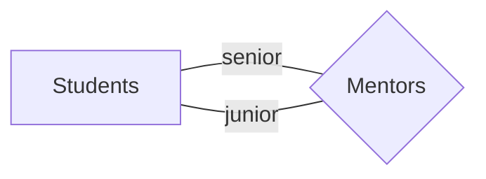
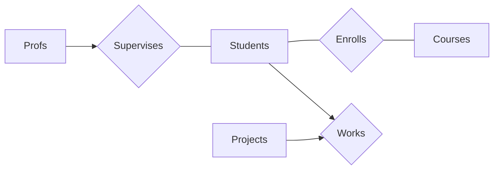
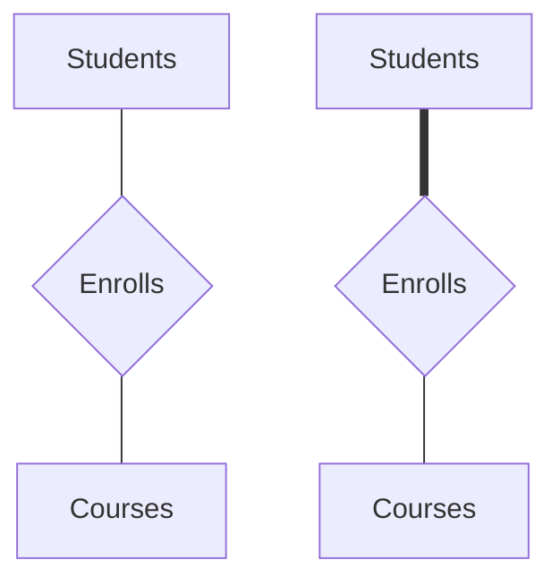
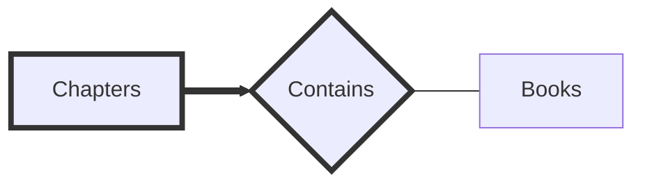
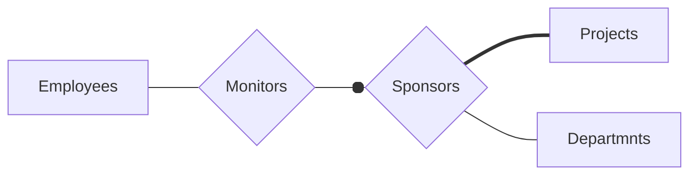
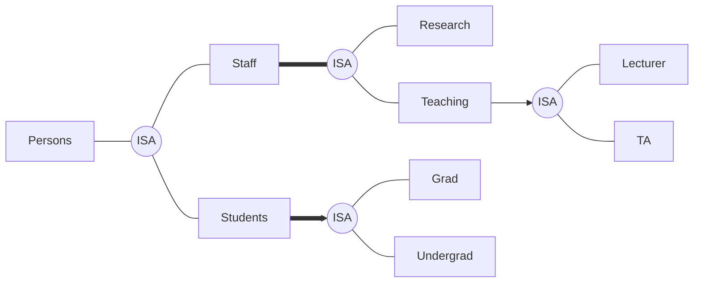

## Lecture 01: Introduction

### § Database Management System (DBMS)

Software for managing large persistent data

##### Advantages

Independence, efficient, integrity, security, administration, transaction management, query language

##### Study of DBMS

- DB design
- DB programming
- DB implementation

##### Describing Data

1. **Data model**: collection of concepts e.g. relational
2. **Schema**: description of the structure
3. **Schema instance**: content of DB at a particular time

### § Relational Data Model

| Term                                 | Meaning                                                      |
| ------------------------------------ | ------------------------------------------------------------ |
| Relation                             | A set of tuples, tables with rows (**cardinality**) and columns (**parity/degree**) |
| Relation schema $R(A_1, \dots, A_n)$ | Specifies attributes and data constraints                    |
| Tuple/record                         | A row in relation, has one component for each attribute      |
| $\text{domain}(A_i)$                 | A set of atomic values possible for an attribute $A_i$       |
| $\text{null}$                        | Used to indicate the value is either not applicable or unknown |
| Relational database schema           | A set of relation schemas                                    |
| Relational database                  | A collection of tables                                       |

#### • Integrity Constraints (ICs)

A condition that restricts the data that can be stored

Specified when schema is defined, checked when relations are updated

Legal relation instance: relation that satisfies all specified ICs

$R(A_1, \dots, A_n) \subseteq \{(a_1, \dots, a_n) | a_i \in \text{domain}(A_i) \cup \{\text{null}\}\}$

##### Types of ICs

- Domain constraints (attribute values)
- Key constraints
- Foreign key constraints
- Other general constraints

##### Key Constraints

**Superkey**: subset of attributes that uniquely identifies tuples

**Key**: minimal subset of attributes that uniquely identifies tuples, no proper subset of key is superkey

1. Key attribute values cannot be $\text{null}$
2. $R$ can have multiple candidate keys, of which one is selected as primary key

##### Foreign Key Constraints (Referential Integrity)

**Foreign key**: a subset of attributes that refers to the primary key of a second relation

Each foreign key value in referencing relation must be

1. Primary key value in the referenced relation
2. $\text{null}$

Referenced and referencing can be the same relation

#### • Data Abstraction

1. External schema: customised view of logical schema for users, provides logical data independence
2. Logical schema: logical structure of data, provides physical data independence
3. Physical schema: how data described in logical schema is physically organised in DBMS

#### • Transactions

Start with `BEGIN`, end with either `COMMIT` or `ROLLBACK`

ACID properties:

1. Atomicity: either all effects are reflected or none are
2. Consistency: preserved by execution in isolation
3. Isolation: isolated from effects of concurrent transactions
4. Durability: effects persists even during system failures

## Lecture 02: Relational Algebra

### § Relational Operators

#### Unary

##### • Selection $\sigma_c$

<u>Meaning</u>: select tuples that satisfy selection condition $c$

- $\forall t \in R, \,t \in \sigma_c(R) \leftrightarrow c$ evaluates to $\text{true}$ on $t$

<u>Schema</u>: same as $R$

Selection condition: boolean combination of **terms**:

1. attribute $\text{op}$ constant
2. attribute $\text{op}$ attribute
3. term $\text{and}$ term
4. term $\text{or}$ term
5. $\text{not}$ term
6. $\text{(}$term$\text{)}$

$\text{op} \in \{=, <>, <, \leq, >, \geq\}$

Precedence: $() > \text{op} > \text{not} > \text{and} > \text{or}$

Selection conditions with $\text{null}$:

- Comparison operation: $\text{unknown}$
- Arithmetic operation: $\text{null}$

##### • Projection $\pi_\ell$

<u>Meaning</u>: project attributes given by list $\ell$

- $\forall$attribute $\in \ell,$ attribute $\in \text{attr}(R)$
- Duplicate records are removed

<u>Schema</u>: determined by $\ell$

##### • Renaming $\rho_\ell$

<u>Meaning</u>: renames attributes based on renamings

- $\forall (a_i:b_i) \in \ell, a_i \in R$
- Each attribute renamed at most once
- Order of renamings in $\ell$ does not matter

<u>Schema</u>: same as $R$ except renamed attributes

#### Binary

##### • Union $\cup$

$R \cup S \to$ all tuples that occur in $R$ or $S$ or both

##### • Intersect $\cap$

$R \cap S \to$ all tuples that occur in both $R$ and $S$ 

##### • Difference $-$

$R - S \to$ all tuples that occur in $R$ but not $S$

**<u>Union compatibility</u>:**

1. Same number of attributes (degree)
2. Corresponding attributes have the same domains
3. NOT necessarily use the same name

- $R\, \text{op} \, S, \text{op} \in \{\cup, \cap, -\}$ gives same schema as $R$

##### • Cross Product $\times$

<u>Meaning</u>: cartesian product of two relations

- $R \times S = \{(a, b, c, x, y) | (a, b, c) \in R, (x, y) \in S\}$

<u>Schema</u>: combination of $R$ and $S$

#### Join

Combines $\times$, $\sigma$, $\pi$, more convenient to use 

##### • Inner Join $\bowtie_c$

$R \bowtie_c S = \sigma_c(R \times S)$

##### • Natural Join $\bowtie$

$R \bowtie S = \pi_\ell(R \bowtie_c \rho_{a_1:b_1, \dots, a_n:b_n}(S))$

$c$: $(a_1 = b_1) \land \cdots \land (a_n = b_n)$

$\ell$: attributes in both $R$ & $A$, followed by attributes in $R$ 

but not $A$, followed by attributes in $S$ but not $A$

$A$: common attributes between $R$ & $S$ $= \{a_1, a_2, \dots, a_n\}$

**<u>Dangling Tuple</u>:**

A tuple in that does not participate in join operation

$t\in R$ is dangling tuple if $t \notin \pi_{\text{attr}(R)}(R \bowtie_c S)$

To preserve dangling tuples, use outer joins

##### • Left/Right/Full Join $\rightarrow_c \, \leftarrow_c \, \leftrightarrow_c$

$\text{dangle}(R \bowtie_c S)$: set of dangling tuples in $R$

$\text{null}(R)$: tuple of null values with number of component being arity of $R$

$R \to_c S = (R \bowtie_c S) \cup (\text{dangle}(R \bowtie_c S) \times \{ \text{null}(S)\})$

$R \leftarrow_c S = (R \bowtie_c S) \cup (\{ \text{null}(R)\} \times \text{dangle}(S \bowtie_c R))$

$R \leftrightarrow_c S = (R \to_c S) \cup (\{ \text{null}(R)\} \times \text{dangle}(S \bowtie_c R))$

##### • Natural Left/Right/Full Join $\rightarrow \, \leftarrow \, \leftrightarrow$

$R \to S = \pi_\ell(R\to_c \rho_{a_1:b_1, \dots, a_n:b_n}(S))$

$R \leftarrow S = \pi_\ell(R\leftarrow_c \rho_{a_1:b_1, \dots, a_n:b_n}(S))$

$R \leftrightarrow S = \pi_\ell(R\leftrightarrow_c \rho_{a_1:b_1, \dots, a_n:b_n}(S))$

### § Relational Algebra Expression (RAE)

Relations are closed under operators

Operators can be composed to form **RAEs**:

1. Relation
2. $\text{op}(R), \text{op} \in$ unary operators
3. $R \, \text{op} \,(S), \text{op} \in$ binary operators
4. $(R)$

To improve readability of RAE queries

1. Operator trees (post order traversal)
2. Sequence of steps

## Lecture 03: SQL (Part 1)

```sql
-- comments
/* commments */
```

```sql
-- x <> y if both non-null
-- false if both are null
-- true if one is null
x IS DISTINCT FROM y
```

### § Database Modifications

##### Create / Drop Table

```sql
CREATE TABLE Students(
  studentId	INTEGER, name VARCHAR(100), birthDate DATE
);
DROP TABLE IF EXISTS TableName CASCADE;
```

##### Retrive

```sql
SELECT * FROM Students;
```

##### Insert

```sql
INSERT INTO Students values (123, 'Alice', '2000-01-01');
-- attributes not stated will be null or default value
INSERT INTO Students(name, studentId) values ('Bob', 456);
```

##### Delete

```sql
DELETE FROM Students;
DELETE FROM Students WHERE studentId = 123;
```

##### Update

```sql
UPDATE Accounts SET balance = balance * 1.02 WHERE accountId = 123;
```

##### Modify Schema

```sql
ALTER TABLE Students ALTER COLUMN dept DROP DEFAULT;
ALTER TABLE Students DROP COLUMN dept;
ALTER TABLE Students ADD COLUMN faculty VARCHAR(20);
ALTER TABLE Students ADD CONSTRAINT grade FOREIGN KEY (grade) REFERENCES Grades;
```

### § Constraints

Column / Table / Assertions

Constraint is violated if it evaluates to $\text{false}$

Give constraint names to constraints

##### Not Null

```sql
CREATE TABLE STUDENTS(
	name VARCHAR(100) NOT NULL
);
```

##### Unique

```sql
CREATE TABLE Students(
  studentId INTEGER UNIQUE
);
CREATE TABLE Census(
  city VARCHAR(50), state CHAR(2), population INTEGER,
  UNIQUE(city, state)
);
```

$\text{null}$ does not violate unique constraint

##### Primary key

```sql
CREATE TABLE Students(
	studentId INTEGER PRIMARY KEY -- only 1 primary key
  studentId INTEGER UNIQUE NOT NULL -- equivalent
);
CREATE TABLE Enrolls(
  sid INTEGER, cid INTEGER, grade CHAR(2),
  PRIMARY KEY(sid, cid)
);
```

##### Foreign Key

```sql
CREATE TABLE Enrolls(
	sid INTEGER REFERENCES Students(studentId),
  cid INTEGER,
  FOREIGN KEY(cid) REFERENCES Courses(CourseId)
);
CREATE TABLE Events(
	lvl INTEGER, number INTEGER,
  FOREIGN KEY(lvl, number) REFERENCES Rooms(lvl, number)
  MATCH FULL -- cannot be partially null
);
```

Foreign key referenced to need not be primary key, but must be unique

###### Violations:

Deletion/update could violate foreign key constraint

```sql
ON UPDATE CASCADE
ON DELETE SET DEFAULT
```

1. `NO ACTION`: rejects delete/update, default action
2. `RESTRICT`: similar to `NO ACTION` except constraint checking cannot be deferred
3. `CASCADE`: propagates delete/update to referencing tuples
4. `SET DEFAULT`: updates to some default value
5. `SET NULL`: updates to $\text{null}$

##### Check

```sql
CREATE TABLE Lectures(
  cname CHAR(5),
  day SMALLINT CONSTRAINT lecture_day CHECK (day IN (1,2,3,4,5)),
  hour SMALLINT CONSTRAINT lecture_hour CHECK (hour >= 8 AND hour <= 17),
  CONSTRAINT lecture_pk PRIMARY KEY (cname,day,hour)
);
```

#### Deferrable constraints

Checking of unique, primary key & foreign key constraints can be deferred to the end of transaction

`DEFERRABLE INITIALLY DEFERRED` or `DEFERRABLE INITIALLY IMMEDIATE`

```sql
CREATE TABLE Employees(
	eid INTEGER PRIMARY KEY, ename VARCHAR(100), managerId INTEGER,
  CONSTRAINT employees_fk FOREIGN KEY(managerId) REFERENCES Employees
  	DEFERRABLE INITIALLY IMMEDIATE
);
BEGIN
	SET CONSTRAINT employees_fk DEFERRED; -- only for this transaction
	DELETE FROM Employees WHERE eid = 2;
	UPDATE Employees SET managerId = 1 WHERE eid = 3;
COMMIT
```

## Lecture 04: ER Model

| Term              | Meaning                                                      |
| ----------------- | ------------------------------------------------------------ |
| Entity            | Real-world object                                            |
| Attribute         | Information describing an entity                             |
| Relationship      | Association among two or more entities                       |
| Primary keys      | Underlined for entities                                      |
| Relationship keys | cUnderlined for relations<br />$\displaystyle \text{Key}(R) = A' \cup \bigcup _{E_i \in E'}\text{Key}(E_i)$<br />Attribues $A' \subseteq \{A_i, \dots, A_k\}$<br />Entities $E' \subseteq \{E_i, \dots, E_n\}$ |

### § Relationship Roles



### § Relationship Constraints

#### • Key Constraints 

##### Many-To-Many

Each student enrolled in 0 or more course, each course enrolled by 0 or more students

##### One-To-Many / Many-To-One

Each professor supervise many students, each student supervised by one professor

##### One-To-One

Each student work on at most one project, each project worked on by at most one students



#### • Participation Constraints

##### Partial

Thin line, each student enrolled in 0 or more courses

##### Total

Thick line, each students enrolled in at least one course




### § Miscellaneous

#### • Weak Entity Sets

Does not have its own key, identified by primary key of owner, existence dependent on owner entity

Must have many-to-one identifying, relationship must have total participation



#### • Aggregation




#### • ISA Hierachy

##### Overlap Constraint 

Can entity belong to multiple subclasses?

Satisfies: undirected	Does not satisfy: directed

##### Covering Constraint

Must entity belong to some subclass?

Satisfies: thick	Does not satisfy: thin



## Lecture 05: SQL (Part 2)

#### § Simple Queries

```sql
SELECT [DISTINCT] a1, ..., am
-- SELECT * (all attributes)
-- SELECT a1 * a2 AS n1 (alias)
-- SELECT a3 || a4 AS n2 (concatenation)
FROM r1, ..., rn
WHERE c;
```

$\pi_{a_1, \dots, a_m}(\sigma_c(r_1 \times \dots \times r_n))$

##### Set Operations

```sql
UNION / INTERSECT / EXCEPT -- eliminate duplicates
UNION ALL / INTERSECT ALL / EXCEPT ALL
```

`INTERSECT` has higher precedence

#### § Multi-Relation Queries

```sql
-- cross join
FROM r1 AS A, r2 AS B -- alias
FROM r1 CROSS JOIN r2
-- inner join
FROM r1 INNER JOIN / JOIN r2 ON r1.a1 = r2.a1
-- natural join
FROM r1 NATURAL JOIN r2
-- left/right outer join
FROM r1 LEFT / RIGHT [OUTER] JOIN r2
-- natural left/right outer join
FROM r1 NATURAL LEFT / RIGHT [OUTER] JOIN r2
```

#### § Subqueries

##### `EXISTS`

Returns $\text{true}$ if output non-empty, otherwise returns $\text{false}$

```sql
WHERE [NOT] EXISTS (SELECT 1 FROM ... WHERE ...)
```

##### `IN`

Returns $\text{false}$ if output empty, otherwise returns $((v=v_1) \lor (v=v_2) \lor \dots \lor (v=v_n))$

Subquery must return exactly one column

```sql
WHERE v IN (SELECT a FROM r WHERE ...)
WHERE v IN (v1, v2, ..., vn) -- alternative form
```

##### `ANY/SOME`

Returns $\text{false}$ if output empty, otherwise returns $((v\text{ op }v_1) \lor (v\text{ op }v_2) \lor \dots \lor (v\text{ op }v_n))$

Subquery must return exactly one column

```sql
WHERE v op ANY(SELECT a FROM r WHERE ...)
```

##### `ALL`

Returns $\text{true}$ if output empty, otherwise returns $((v\text{ op }v_1) \land (v\text{ op }v_2) \land \dots \land (v\text{ op }v_n))$

Subquery must return exactly one column

```sql
WHERE v op ALL(
  SELECT a FROM r
  WHERE a IS NOT NULL -- take care of NULL
  AND ...
)
```

##### Row Constructors

`IN/ANY/ALL` can use subqueries the return more than one column

```sql
WHERE row(a1, a2) IN/op ANY/op ALL(
  SELECT a1, a2 FROM r WHERE ...
)
```

##### Scalar Subqueries

Subquery that returns at most one tuple with one column or `NULL`

Can be used as a scalar expression

##### Usage of Subqueries

- `WHERE` clause

- `FROM` clause, must be enclosed in parentheses and assigned alias

	```sql
	FROM r1 NATURAL JOIN (
	  SELECT a1 FROM r2 WHERE ...
	) AS r
	```

- `HAVING` clause

#### § Miscellaneous Clauses

```sql
ORDER BY a1 ASC, a2 DESC -- ascending/ desceding order
LIMIT n -- find the top n tuples
OFFSET n -- exclude the top n tuples
```

## Lecture 06: SQL (Part 3)

#### § Aggregate Functions

Computes a single value from a set of tuples

Used in `SELECT`, `HAVING`, `ORDER BY` or subqueries

- `MIN/MAX/AVG/SUM`: returns the same for empty relation and relation with only `NULL` values
- `COUNT(A)`: returns number of non-null values
- `COUNT(*)`: returns number of rows

#### § `GROUP BY` & `HAVING` Clauses

In $\texttt{GROUP BY} \, a_1, \dots, a_n$, two tuples $t$ and $t'$ belongs to the same group if $\forall i \in [1, n], \, t.a_i \, \texttt{IS NOT DISTINCT FROM} \, t'.a_i$

For each column $A$ in $R$ that appears in `SELECT` or `HAVING`, one of the following conditions must hold:

1. $A$ appears in `GROUP BY`
2. $A$ appears in an aggregated expression
3. Primary key of $R$ appears in `GROUP BY`

If aggregate function appears in `SELECT` but there is no `GROUP BY`, `SELECT` must not contain any non-aggregated expressions

#### § Conditional Expressions

##### `CASE`

```sql
CASE [expression]
	WHEN condition_1/value_1 THEN result_1
	...
	WHEN condition_n/value_n THEN result_n
	ELSE result_0
END
```

##### `COALESCE`

`COALESCE(first, second, third)`

Returns first non-null value in arguments, returns `NULL` if all arguments are `NULL`

##### `NULLIF`

`NULLIF(value_1, value_2)`

Returns `NULL` if `value_1` is equal to `value_2`, otherwise returns `value_1`

#### § Evaluation of Queries

```sql
SELECT select-list
FROM from-list
WHERE where-condition
GROUP BY group-by-list
HAVING having-condition
ORDER BY order-by-list
LIMIT ... OFFSET ...
```

1. Compute cross-product in `from-list`
2. Select tuples for `where-condition`
3. Partition using `group-by-list`
4. Select groups with `having-condition`
5. Generate output for attributes in `select-list`
6. Remove duplicate tuples
7. Sort output tuples based on `order-by-list`
8. Remove tuples based on `OFFSET` and `LIMIT`

#### § Miscellaneous

##### Common Table Expressions (CTEs)

```sql
WITH
	R1 AS (Q1),
	R2 AS (Q2),
	...,
	RN AS (Qn)
SELECT / INSERT / UPDATE / DELETE ...
```

##### Views

Virtual relation used for querying

```sql
CREATE VIEW v(b1, b2) AS -- rename columns
	SELECT a1, a2
	FROM ...
```

##### Pattern Matching `LIKE`

`-`: single character

`%`: sequence of 0 or more characters

`SIMILAR TO`: regex

##### Universal Quantification

A pair of `NOT EXISTS` to replace "for all"

## Lecture 07: PL/pgSQL

#### § Procedural Language Implementation

1. Host language + SQL

	- Statement-level interface

		1. Write program, mix host language
		2. Preprocess
		3. Compile

	- Call-level interface

		1. Write in host language only
		2. Compile

		Need to load library

2. PL/pgSQL

#### § PL/pgSQL

Code reuse, ease of maintenance, performance, security

##### Functions

```sql
CREATE OR REPLACE FUNCTION <f_name>
	(<param> <type>, ...)
RETURNS <type> AS $$ -- return first tuple
...
$$ LANGUAGE sql;

-- variants
RETURNS SETOF <type> -- more than one tuple
(IN <param> <type>, OUT <output> <type>, ...) -- custom tuple
RETURNS TABLE(<param> <type>, ...) -- simplfied
RETURNS VOID -- can use procedure also

-- invocation
SELECT <f_name>(...); -- tuple
SELECT * FROM <f_name>(...); -- table
```

##### Procedures

```sql
CREATE OR REPLACE PROCEDURE <p_name>
	(<param> <type>, ...)
AS $$
...
$$ LANGUAGE sql;

-- invocation
CALL <p_name>();
```

##### Variable

```sql
CREATE OR REPLACE FUNCTION <f_name>
	(IN <param> <type>, OUT <output> <type>)
RETURNS <type> AS $$
DECLARE
	<name> <type> := <value>;
BEGIN
	SELECT ... INTO <val> FROM ...;
	<name> := ...;
	...
	RETURN; -- optional, exit function
END;
$$ LANGUAGE plpgsql;

-- variants: return set of tuples, does not exit
RETURN QUERY SELECT ...;
RETURN NEXT;
```

##### Control Structure

```sql
-- if-else
IF ... THEN ... 
ELSIF ... THEN ...
ELSE ...
END IF;
-- while loop
WHILE ... LOOP
	...
END LOOP;
LOOP
	EXIT WHEN ...
	...
END LOOP;
-- for loop
FOREACH ... IN ARRAY ... LOOP
	...
END LOOP;
```

##### Cursor

```sql
DECLARE
	curs CURSOR FOR (SELECT ... FROM ...);
	r RECORD;
BEGIN
	OPEN curs;
	...
	CLOSE curs;
```

```sql
-- cursor movement (equivalent)
FETCH curs INTO r;
FETCH NEXT FROM curs INTO r;
-- variants
FETCH PRIOR/FIRST/LAST FROM curs INTO r;
FETCH ABSOLUTE/RELATIVE <num> FROM curs INTO r;
MOVE LAST FROM curs;
UPDATE/DELETE <table> ... WHERE CURRENT OF curs;
```

#### § SQL Injection

```sql
-- function/procedure
query = "SELECT * FROM <f_name>" + "(" + <var> + ");"; 
-- prepare
EXEC SQL PREPARE stmt FROM :query;
```

## Lecture 08: Triggers

Two issues to address

1. Need a way to express condition about insertion/update/deletion: trigger functions
2. Need database to check this condition whoever possible: triggers

```sql
CREATE OR REPLACE FUNCTION trigger_func()
RETURNS TRIGGER AS $$ -- only RETURNS TRIGGERS allowed
DECLARE ...
BEGIN
	-- NEW: new tuple being inserted/updated
	-- OLD: old tuple being deleted/updated, null for insert
	-- TG_OP: INSERT|UPDATE|DELETE
	-- TG_TABLE_NAME: table that invoked trigger
END;
$$ LANGUAGE plpgsql;

CREATE TRIGGER trigger_name
[BEFORE|AFTER|INSTEAD OF] INSERT|UPDATE|DELETE [OR ...]
ON table_name
FOR EACH ROW|STATEMENT EXECUTE FUNCTION trigger_func();
```

#### § Trigger Timing

##### `BEFORE`

- Non-null: tuple will be inserted/updated/deleted
- Null: no insertion/update/deletion

##### `AFTER`

Return value does not matter

##### `INSTEAD OF`

Usual usage: do something on a table instead of view

- Non-null: proceed as normal
- Null: ignore rest of the operation

#### § Trigger Levels

##### Row-level

`INSTEAD OF` not allowed for row-level

##### Statement-level

Ignores values returned

To omit subsequent operations: `RAISE EXCEPTION`

#### § Trigger Condition

```sql
CREATE TRIGGER trigger_name
BEFORE ... FOR EACH ROW
WHEN (condition)
EXECUTE FUNCTION trigger_func();
```

Requirements:

1. No `SELECT`
2. No `OLD` for `INSERT`
3. No `NEW` for `DELETE`
4. No trigger condition for `INSTEAD OF`

#### § Deferred Trigger

Put operations in one transaction, defer trigger to the end

```sql
CREATE CONSTRAINT TRIGGER trigger_name
AFTER ...
DEFERRABLE INITIALLY DEFERRED|IMMEDIATE
FOR EACH ROW EXECUTE FUNCTION trigger_func();
```

Deferred trigger only work with `AFTER` and `FOR EACH ROW`

```sql
-- if trigger is initially immediate
BEGIN TRANSACTION;
SET CONSTRAINTS trigger_name DEFERRED;
...
COMMIT;
```

#### § Trigger Order

1. `BEFORE` statement-level
2. `BEFORE` row-level
3. `AFTER` row-level
4. `AFTER` statement-level

Within each category, trigger activated alphabetically

If `BEFORE` row-level returns `NULL`, subsequent triggers on the same row omitted

## Lecture 09: Functional Dependency

#### § Functional Dependency

$A_1A_2 \dots A_m \to B_1B_2 \dots B_m$

Whenever two objects have same $A_1,A_2,\dots,A_m$, they always have same $B_1, B_2, \dots, B_m$

FD might hold on one table but does not hold on another

FD comes from

- Common sense
- Application's requirements

#### § Reasoning with FD

Given a set of FDs, figure out what other FDs imply

##### Armstrong's Axioms

1. Reflexivity: $AB \to A, AB \to B$

2. Augmentation: $A \to B \Rightarrow AC \to BC$

3. Transitivity: $A \to B, B \to C \Rightarrow A \to C$

4. Decomposition: $A \to BC \Rightarrow A\to B, A \to C$

	R: $BC \to B, BC \to C$

	T: $A \to BC \to B/C$

5. Union: $A \to B, A \to C \Rightarrow A \to BC$

	A: $A \to B \Rightarrow A \to AB$

	A: $A \to C \Rightarrow AB \to BC$

	T: $A \to AB, AB \to BC \Rightarrow A \to BC$

##### Closure

The set of attributes that can be decided directly or indirectly

$\{A_1, A_2, \dots, A_m\}^+$

To prove $X \to Y$, simply show $Y \in \{X\}^+$

Computing closures:

1. Initialise closure as ${A_1, A_2, \dots, A_n}$
2. If there is an FD $A_i, A_j, \dots, A_m \to B$, put $B$ into the closure
3. Repeat step 2 until no new attribute can be found

#### § Keys

Superkey: set of attributes that decides all other attributes

Key: a super key that is minimal (different from keys of entity sets)

A table may have multiple keys, some keys may contain more attribute

Finding keys:

1. Enumerate all attribute subsets
2. Compute closures of subsets
3. Identify superkeys
4. Identify keys

Tricks:

* Check small attribute sets first
* If $A$ does not appear in the right hand side of any FDs, $A$ must be in key

## Lecture 10: Boyce-Codd Normal Form

Normal form: minimum requirements to reduce data redundancy and improve data integrity

#### § Non-Trivial and Decomposed FD

Decomposed: FD whose right hand side has only one attribute

Non-trivial: FD whose RHS does not appear in the LHS

A non-decomposed FD can always be transformed into a set of decomposed FDs

To generate non-trivial and decomposed FDs of $R$:

1. Consider all attribute subsets
2. Compute the closure of each subset
3. Remove RHS from LHS
4. Derive and decompose from each closure

#### § BCNF Definition

$R$ is in BCNF if every non-trivial and decomposed FD has a superkey as its LHS

$A_1A_2\dots A_n\to B \Rightarrow A_1A_2\dots A_n$ is a superkey, dependency on non-super keys is prohibited

Good properties:

1. No insertion/update/deletion anomalies
2. Small data redundancy
3. Original table can always be reconstructed from decomposed tables

Bad properties:

1. Dependencies may not be preserved

#### § Checking of BCNF

##### Tedious

1. Compute the closure for each attribute subset
2. Derive the keys of $R$
3. Derive all non-trivial and decomposed FDs on $R$
4. Check if all satisfy BCNF

##### Simplified

Check "more but not all" condition

1. Compute the closure of each attribute subset
2. Check if there is a closure $\{A_1A_2\dots A_k\}^+$ such that the closure contains some other attribute but not all attributes in the table
3. If such closure exists, $R$ is not in BCNF

#### § BCNF Decomposition Algorithm

BCNF decomposition may not be unique

If a table only has 2 attributes, it must be in BCNF, there is no need to check

1. Find an attribute subset $X$ in $R$ such that its closure $\{X\}^+$ satisfies "more but not all"

2. Decompose into two tables $R_1$ and $R_2$ such that

	* $R_1$ contains all attributes in $\{X\}^+$
	* $R_2$ contains all attributes in $X$ and attributes not in $\{X\}^+$

3. If $R_1/R_2$ not in BCNF, further decompose $R_1/R_2$

	To derive the FDs on $R_1/R_2$, project closures of $R$ on them

Each decomposition step removes at least one BCNF violation, recursive decomposition guarantees all violations will be removed in the end

#### § Lossless Join Decomposition

Decomposition guarantees lossless join when common attributes in $R_1$ and $R_2$ constitute a superkey of $R_1$ or $R_2$

## Lecture 11: Third Normal Form

$S$: FDs on the original table

$S'$: FDs on the decomposed tables

$S \equiv S'$ if every FD in $S'$ can be derived from $S$ and vice versa

#### § 3NF Definition

$R$ is in 3NF if and only if for every non-trivial and decomposed FD:

1. Either LHS is a superkey
2. Or RHS is a prime attribute (appear in keys)

3NF is more lenient that BCNF

BCNF $\Rightarrow$ 3NF, 3NF $\not \Rightarrow$ BCNF

#### § Checking of 3NF

1. Compute the closure for each attribute subset
2. Derive of keys of $R$
3. For each closure $\{X_1, \dots, X_k\}^+ = \{Y_1,\dots ,Y_m\}$, check if
	1. $\{Y_1,\dots ,Y_m\}$ does not contain all attributes, and
	2. There is an non-prime attribute in $\{Y_1,\dots ,Y_m\}$ that is not in $\{X_1,\dots ,X_k\}$
4. If such closure does not exist, $R$ is in 3NF

#### § Minimal Basis Definition

$S \Rightarrow M$, Four conditions:

1. Every FD in $M$ can be derived from $S$ and vice versa (equivalence)
2. Every FD in $M$ is non-trivial and decomposed
3. If any FD is removed from $M$, some FD in $S$ cannot be derived (no FD redundancy)
4. For any FD in $M$, if an attribute is removed from LHS, then the FD cannot be derived from $S$ (no attribute redundancy)

#### § Algorithm for Minimal Basis

1. Decompose all FDs so that RHS contains only one attribute
2. Remove redundant attributes on LHS
3. Remove redundant FDs

#### § 3NF Decomposition Algorithm

Table $R$, FDs $S$

1. Derive a minimal basis of $S$
2. Combine FDs whose LHS are the same
3. Create a table for each FD
4. If none of the tables contains a key, create a table that contains any key (for lossless join)
4. Remove any redundant table

#### § BCNF vs 3NF

|                   | BCNF                     | 3NF                   |
| ----------------- | ------------------------ | --------------------- |
| **Decomposition** | Binary split, recursive  | N-ary split, one-time |
| **FD**            | Does not always preserve | Always preserves      |
| **Redundancy**    | Small                    | Not as small          |

Use BCNF if BCNF preserves all FDs

If not: use BCNF if preserving all FDs is not important, 3NF otherwise

